# 企业级智能问数平台业务解决方案（标准完整版）

> 产品V2.0业务能力介绍与V3.0演进规划｜32页｜16:9

## 统一视觉规范

- 比例与背景：16:9；暖白与纯白为主，浅蓝、浅绿用于内容分区；不使用影响阅读的大面积装饰。
- 字体：全篇微软雅黑；封面标题40—54pt，页标题30—36pt，正文15—18pt，图注13—16pt，备注10—13pt。
- 色彩：正文墨蓝`#182033`，主色湖绿`#17745F`，辅色商务蓝`#5C91C8`，浅底色`#F2F8F6`/`#EEF4FA`；橙色`#F47C3C`仅强调关键节点、结论和当前阶段。
- 排版：采用“左上两位编号 + 单行结论式标题 + 章节标签 + 细分隔线”母版；依据逻辑使用对照、流程、时间轴、中心辐射、矩阵、分层架构、原型图等版式，连续页面避免重复卡片阵列。
- 质感：仅使用轻微阴影、透明度和浅色层次，不使用影响专业性的强立体效果；不使用贯穿整页的左侧长实线。
- 页脚：左侧“企业级智能问数平台”，右侧页码；涉及状态的页面标注“产品基线/客户交付”口径。
- 动画：仅使用淡入、擦除和按层出现，单页不超过3组。

### 母版与组件规范

- 内容页顶部：左上角两位页码/章节码（湖绿或橙色，18pt），下方标题28pt、说明语16pt；标题区底部放1pt主色横线。
- 信息卡：白底、1.2pt主色描边、8—12px圆角；卡片标题前使用实心圆点，不使用复杂拟物图标。
- 对比页：左右等宽双卡，中间留0.35英寸；底部增加一条“关系判断/核心结论”通栏卡。
- 架构页：顶部为场景或渠道，中部为平台能力，底部为系统与数据对接；使用浅色分区底，不使用深色满版背景。
- 章节页：左侧放“/01”等大号编号和章节名，右侧可放抽象分层几何图；不使用照片背景。
- 表格页：表头商务蓝或湖绿底、宋体白字；正文隔行浅蓝，边框0.5pt白色；单元格内不超过两行。

## 第1页｜封面

**页面文案**

- 企业级智能问数平台业务解决方案
- 产品V2.0业务能力介绍与V3.0演进规划
- 让业务人员用自然语言安全、准确地获取经营数据
- 汇报单位｜汇报人｜日期

**布局与展示**：左侧55%放标题与副标题，右侧45%用浅蓝几何线条表现“用户—智能—数据”；标题34pt，副标题22pt，宣传语18pt。保持大面积留白。

## 第2页｜目录

**页面文案**：建设背景｜整体方案｜七层机制｜用户端｜管理端｜方案价值｜实施交付｜V3.0演进。

**布局与展示**：2×4编号卡片，每张卡片含序号、章节名和一句说明；章节名20pt。

## 第3页｜建设背景：数据使用的六类矛盾

**页面文案**

- 业务需求多，与数据服务资源有限之间的矛盾。
- 经营决策要求快，与传统取数排期长之间的矛盾。
- 自然语言灵活，与指标口径必须统一之间的矛盾。
- 大模型能力强，与幻觉、越权、不可解释风险之间的矛盾。
- 数据入口分散，与统一经营分析入口之间的矛盾。
- 使用便捷性，与安全、审计、运维要求之间的矛盾。

**布局与展示**：左右对照，左侧“现状”灰色，右侧“目标”蓝色，中间箭头；底部结论条：需要“懂业务、懂数据、受约束、可追溯”的企业智能问数平台。

## 第4页｜目标用户与核心诉求

**页面文案**

| 角色 | 核心诉求 |
|---|---|
| 管理人员 | 快速掌握经营情况、趋势和异常 |
| 业务人员 | 自助查询指标、机构、时间与明细 |
| 数据分析人员 | 减少重复取数、统一指标口径 |
| 数据管理员 | 管理数据资产、指标和查询模板 |
| 系统管理员 | 管理权限、模型、数据源和运行配置 |
| 审计运维人员 | 追踪SQL、调用链、告警和操作审计 |

**布局与展示**：六角色环绕中间“智能问数平台”，每个角色配线性图标；不要直接铺大表格。

## 第5页｜产品定位与建设目标

**页面文案**

定位：面向企业经营管理和业务分析，通过自然语言连接用户、指标体系与受控数据源的智能数据服务平台。

- 降低取数门槛，缩短获得结果的时间。
- 统一指标、维度和业务口径。
- 精确控制功能权限和数据范围。
- 保证SQL安全及回答事实一致。
- 实现全过程追踪、审计和运维。
- 形成可配置、可扩展、可交付的产品底座。

**布局与展示**：页面中心放定位句，周围六个目标卡片；定位句24pt加粗。

## 第6页｜版本建设路径

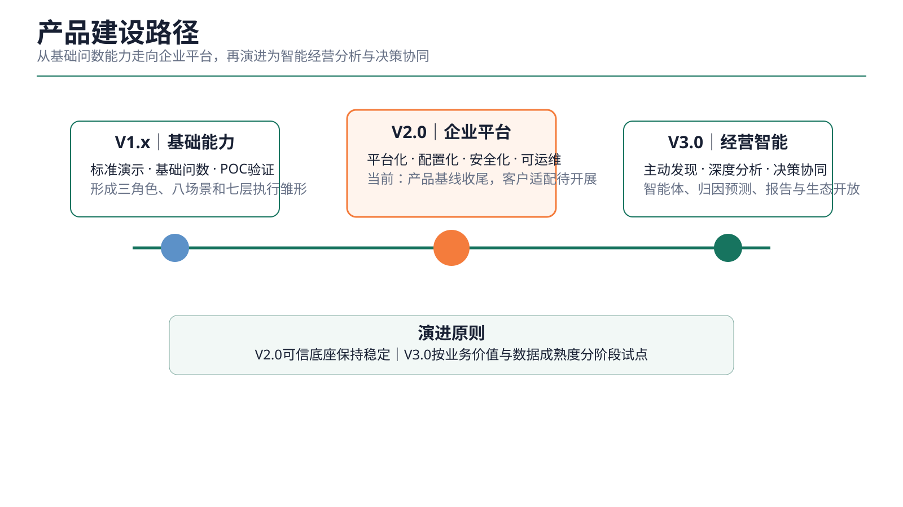

**页面文案**

- V1.x：标准演示、基础问数和POC能力。
- V2.0：企业级平台化、配置化、安全化、可运维化。
- V3.0：从问数工具演进为智能经营分析与决策协同平台。
- 当前状态：M0—M6、完整测试和迁移演练已通过；V2.0基线仍需完成长稳、安全审查和候选发布。

**布局与展示**：横向三段时间轴；V2.0高亮，状态用“已完成/进行中/客户适配”三色图例。不得写“V2.0已交付”。

## 第7页｜总体业务解决方案

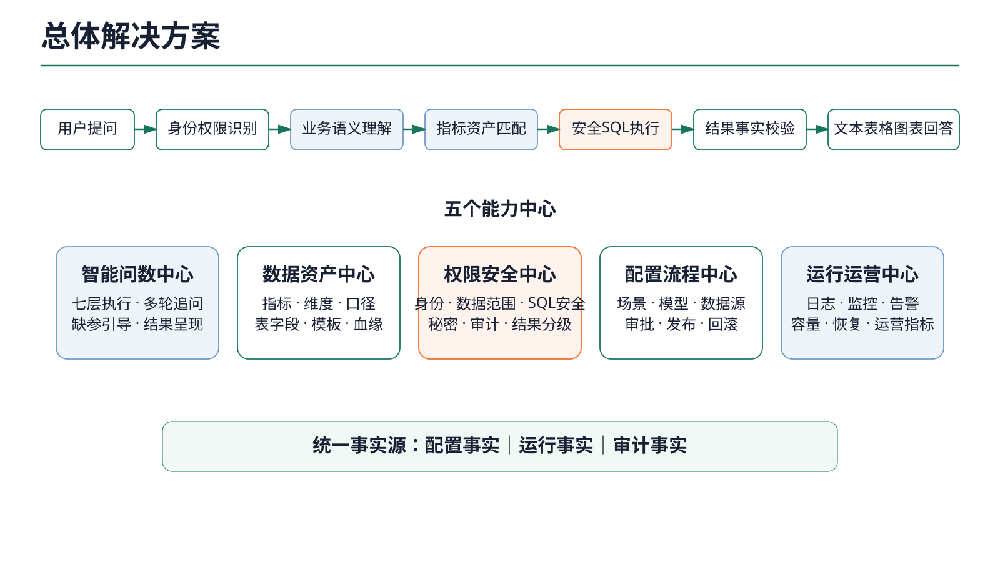

**页面文案**

用户提问 → 身份及权限识别 → 业务语义理解 → 指标与资产匹配 → 安全SQL生成执行 → 结果校验 → 文本/表格/图表回答 → 全程审计。

五个能力中心：智能问数中心、数据资产与指标中心、权限与安全中心、配置与流程中心、运行监控与审计中心。

**布局与展示**：上部放端到端流程，下部放五中心等宽卡片；中心之间用细线连接。

## 第8页｜业务架构图

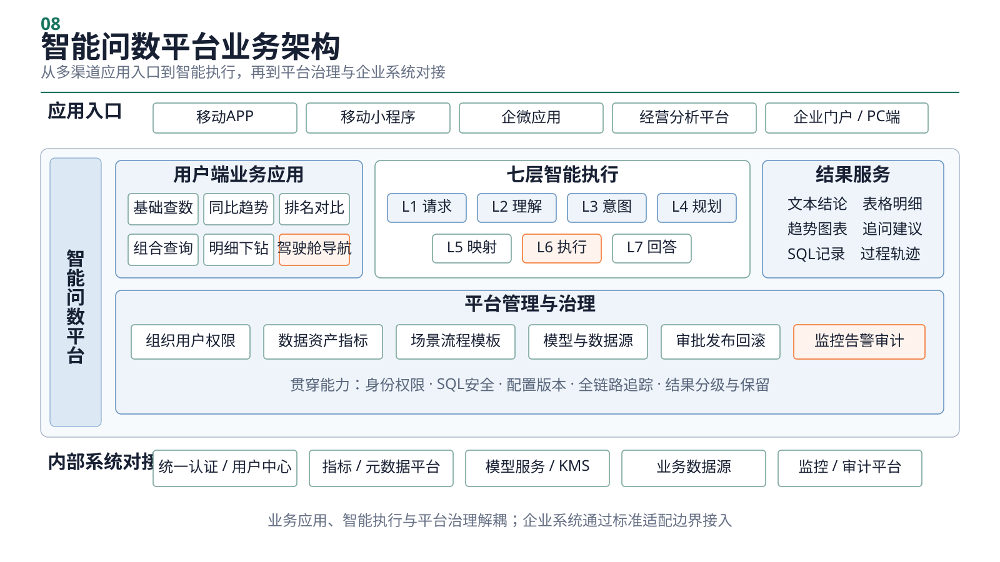

**讲解要点**：从移动APP、移动小程序、企微应用、经营分析平台、企业门户/PC端等应用入口，向下说明用户端业务场景、智能执行、平台管理和技术数据底座；强调身份权限、数据安全、配置版本和审计贯穿全架构。应用入口与业务场景是两个维度，不混用。

**布局与展示**：图片占页面85%，底部一行结论；不要在图片外重复所有节点。

## 第9页｜技术协作架构

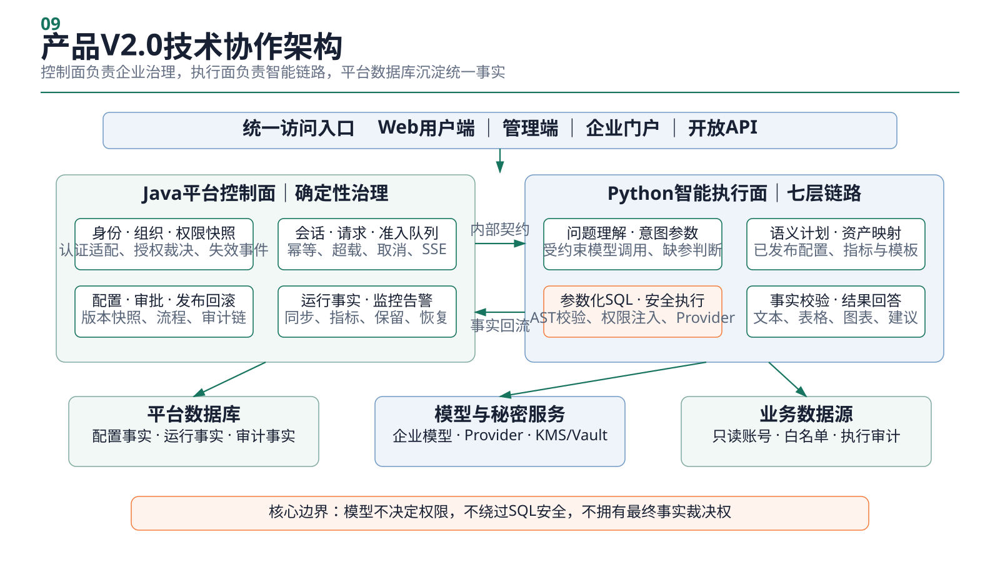

**讲解要点**：Java负责确定性平台治理和企业入口，Python负责七层智能执行；平台数据库统一保存配置、运行与审计事实；模型和数据源通过适配器接入。

**布局与展示**：全幅图片；右下角加蓝色结论标签：“模型不直接拥有权限、安全和最终事实裁决权”。

## 第10页｜网络部署参考架构

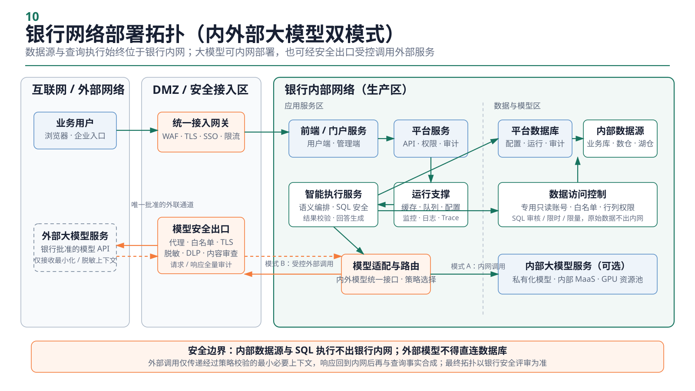

**讲解要点**：按互联网、DMZ/安全接入区、银行内部生产区分区；内部数据源与SQL执行始终留在银行内网。大模型支持两种模式：内网私有化部署，或经模型安全出口受控调用外部服务；外部模型不得直连数据库，仅接收最小化、脱敏后的必要上下文。全链路TLS、业务库只读、凭据外置、管理入口受控，HA、KMS、网关和具体端口由客户适配确认。

**布局与展示**：图片占80%，右侧或底部放“标准参考，非客户最终拓扑”提示。

## 第11页｜七层执行机制总览

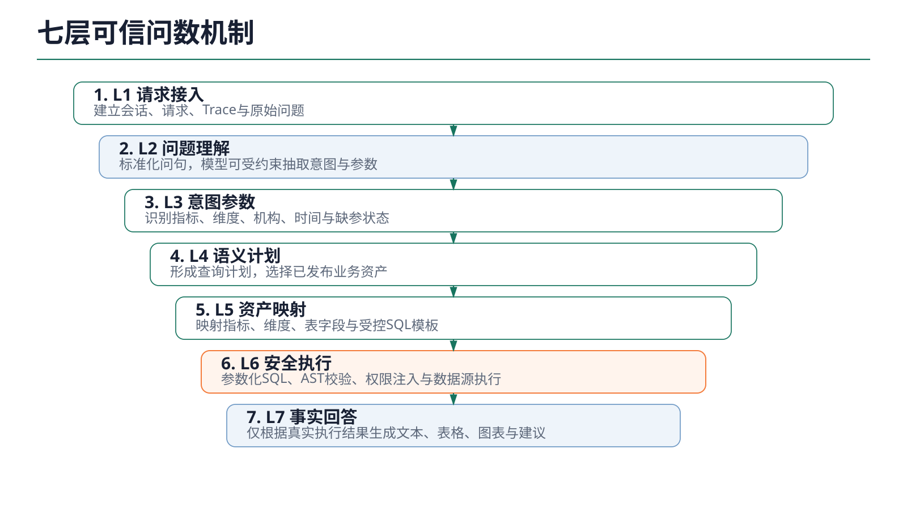

**页面文案**：L1请求接入 → L2问题理解 → L3意图识别 → L4语义规划 → L5资产映射 → L6安全执行 → L7事实回答。

**布局与展示**：七级水平阶梯，每级用序号、名称和一个动词；L2、L7用浅蓝表示“模型可参与”，其他层用白底蓝框表示确定性控制。

## 第12页｜七层职责说明

| 层级 | 核心职责 | 输出 |
|---|---|---|
| L1 | 建立请求、会话和追踪 | 原始问句、Trace |
| L2 | 标准化问题并受约束抽取 | 标准化问句、权限上下文 |
| L3 | 识别场景、指标、机构、时间 | 结构化业务参数 |
| L4 | 形成语义计划、选择已发布资产 | 查询计划 |
| L5 | 映射指标、维度、表和模板 | 受控资产映射 |
| L6 | 参数化SQL、安全校验并执行 | SQL事实、数据结果 |
| L7 | 基于执行事实校验并回答 | 文本、表格、图表、引导 |

**布局与展示**：三列表格，隔行浅蓝；L6、L7加粗。表下写“三条红线”：模型不裁决权限、不绕过SQL安全、不脱离结果作答。

## 第13页｜问数执行流程时序

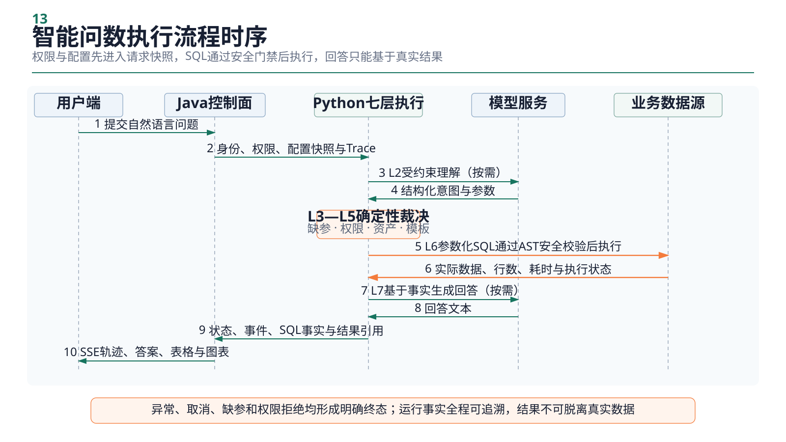

**布局与展示**：图片全幅，按1—10步分两次动画出现；讲解控制在2分钟。

## 第14页｜安全可信机制

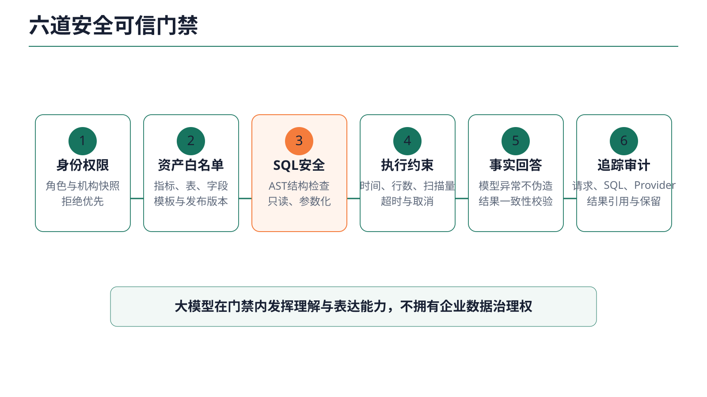

**页面文案**

- 身份、角色和机构权限快照固定。
- 指标、表、字段和模板采用白名单。
- SQL AST结构检查，只允许受控只读查询。
- 注入机构和时间范围，限制行数与扫描量。
- 模型异常不伪造成功，回答必须引用实际事实。
- 请求、层、SQL、Provider和结果引用全程可追溯。

**布局与展示**：用“身份—资产—SQL—执行—回答—审计”六道门禁横向展示；最后用盾牌图标收束。

## 第15页｜用户端能力全景

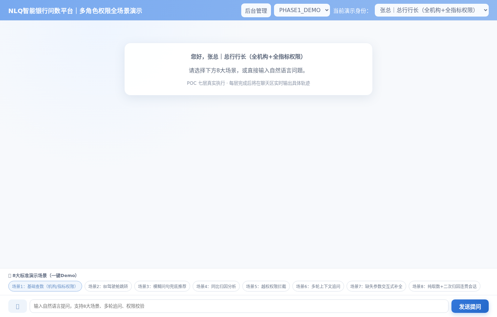
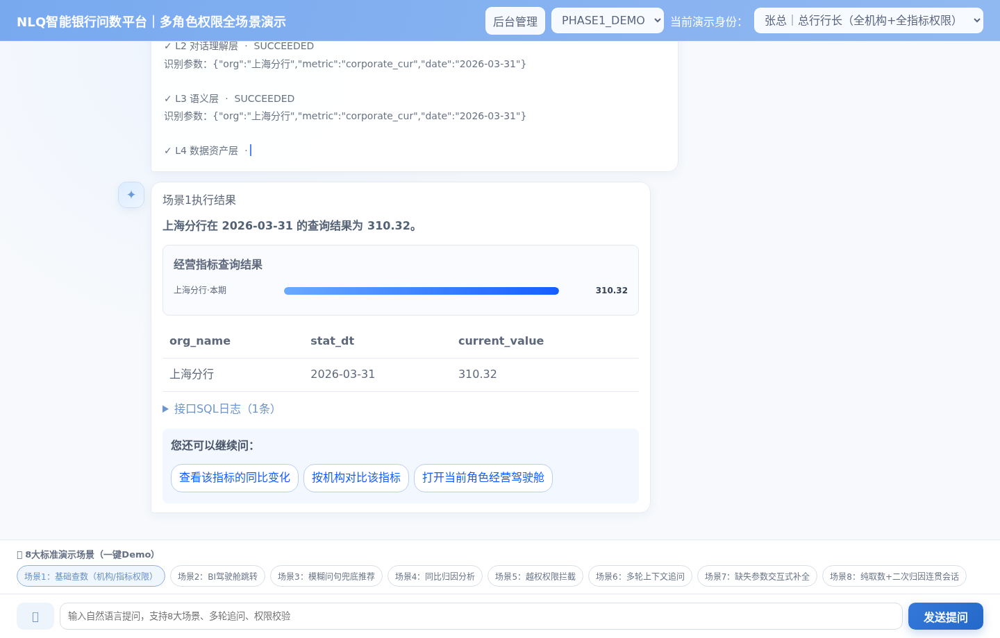

**页面文案**：自然语言提问、八大标准场景、角色权限问数、实时七层轨迹、流式回答、表格图表、SQL记录、多轮追问、缺参引导、推荐问题、执行取消、异常说明。

**布局与展示**：左侧放用户端截图占60%，右侧四组能力标签；没有截图时使用线框占位并标注截图位置。

## 第16页｜八类标准业务场景

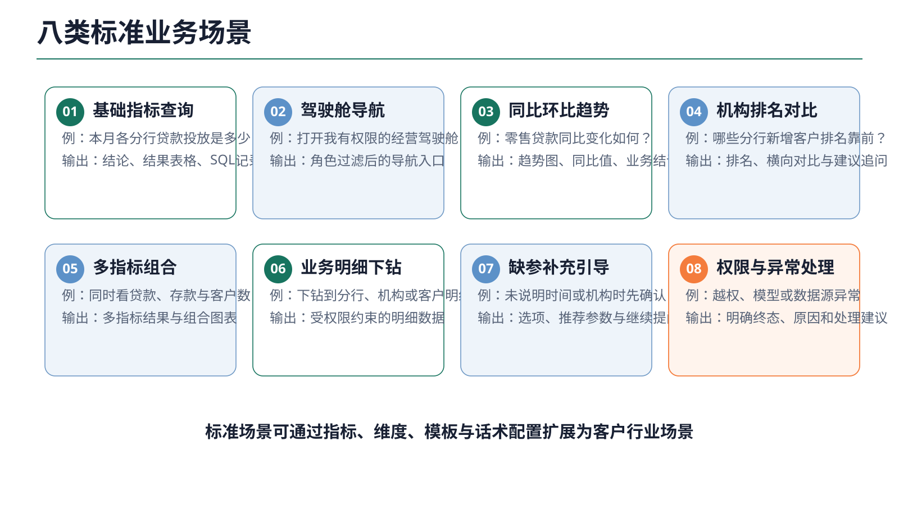

1. 基础指标查询；2. 经营驾驶舱导航；3. 同比环比及趋势；4. 机构排名与横向对比；5. 多指标组合查询；6. 明细查询与下钻；7. 缺参识别与补充引导；8. 权限拦截、异常处理与推荐问法。

**布局与展示**：2×4场景卡片，每卡包含场景名、典型问题、输出形式；避免只写功能名。

## 第17页｜典型场景：指标与趋势分析

**页面文案**

- 示例：“查询2026年3月各分行零售贷款同比变化。”
- 自动识别：时间、机构范围、指标、同比意图。
- 执行控制：角色权限过滤、受控指标与SQL模板匹配。
- 输出：业务结论、结果表格、同比图表及后续追问。

**布局与展示**：左侧35%放问题和识别参数，右侧65%放结果图表与回答模拟；关键参数用蓝色胶囊标签。

## 第18页｜典型场景：驾驶舱导航与多轮下钻

**页面文案**

- 根据当前角色只推荐有权访问的驾驶舱。
- 支持从全行结果追问某分行、某指标或某时间段。
- 缺少必要参数时先引导补充，不盲目访问数据源。
- 角色切换后建立新权限上下文，避免上下文污染。

**布局与展示**：左右双案例；左为导航短路链路，右为“全行→分行→明细”三步追问气泡。

## 第19页｜管理端能力全景

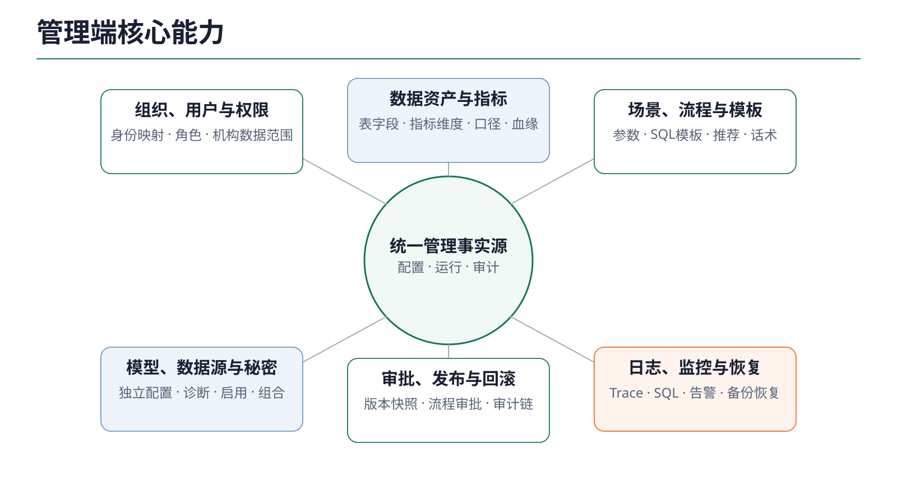
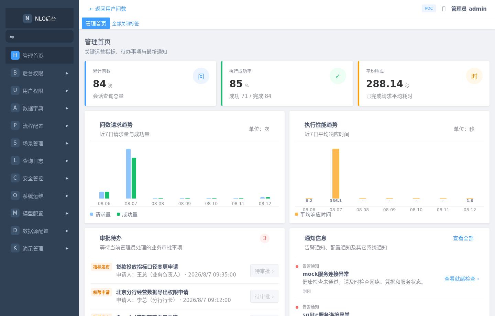

**页面文案**：组织权限、数据资产、指标维度、场景流程、SQL模板、模型配置、数据源配置、运行组合、审批发布、日志监控、告警审计、备份恢复。

**布局与展示**：六边形或六域矩阵；页面中心写“统一管理事实源”。

## 第20页｜组织、权限与审批管理

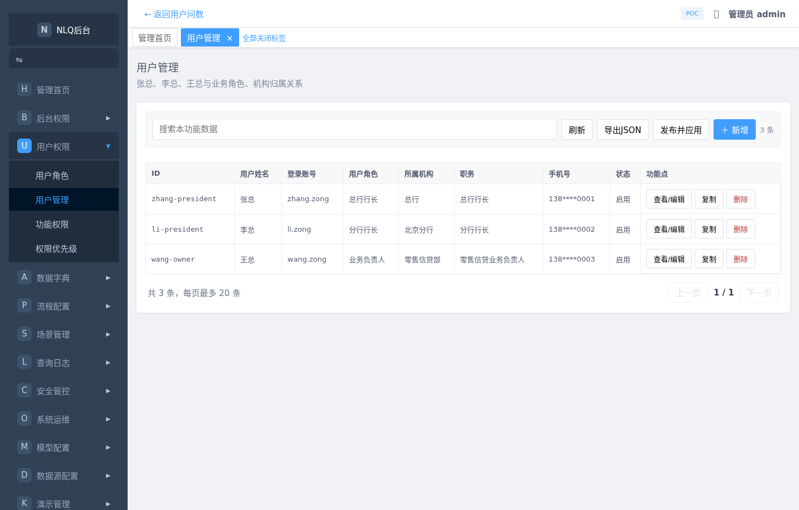

- 组织、用户、角色和外部身份映射。
- 功能、指标、表、字段和机构范围授权。
- 会话权限快照及授权变更失效。
- 多级审批、候选人快照和发布授权。
- 发布、回滚与敏感操作防篡改审计。

**布局与展示**：左侧权限模型树，右侧“草稿—审批—发布—回滚”闭环。

## 第21页｜数据资产与业务配置管理

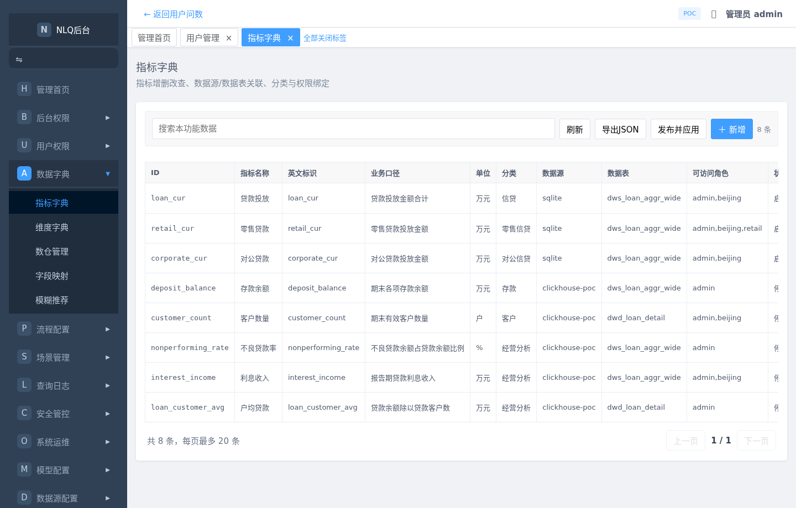

- 数据源、表、字段、指标、维度及业务口径。
- 指标与物理数据资产映射、同义词和血缘。
- SQL模板、参数、机构和时间约束。
- 场景、用例、推荐问题和回答话术。
- 敏感等级、版本及发布关系。

**布局与展示**：从“业务术语”到“指标”到“表字段”到“SQL模板”的映射链；下方放配置版本条。

## 第22页｜模型、数据源与运行管理

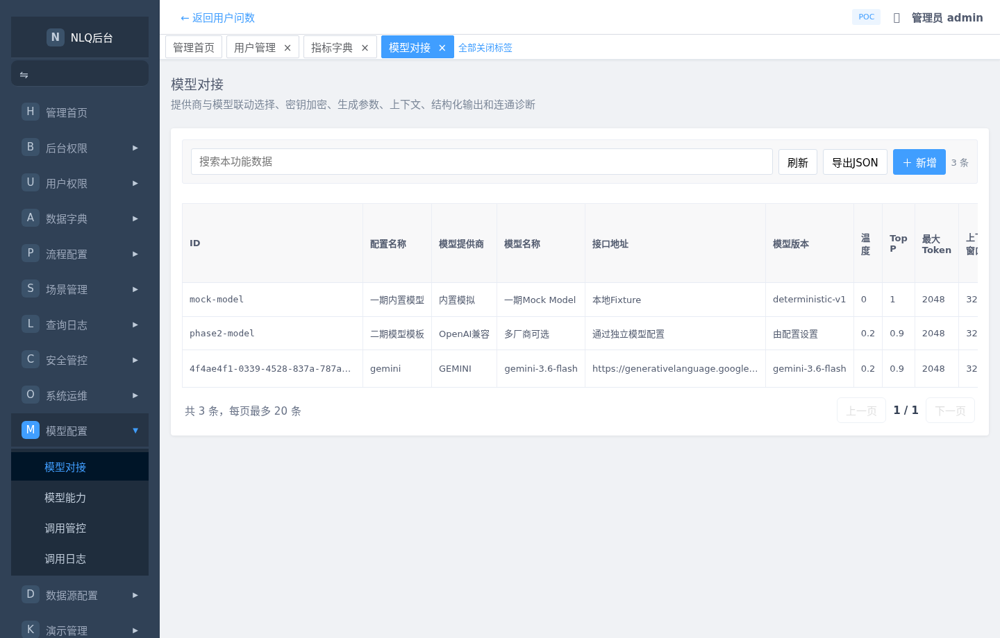
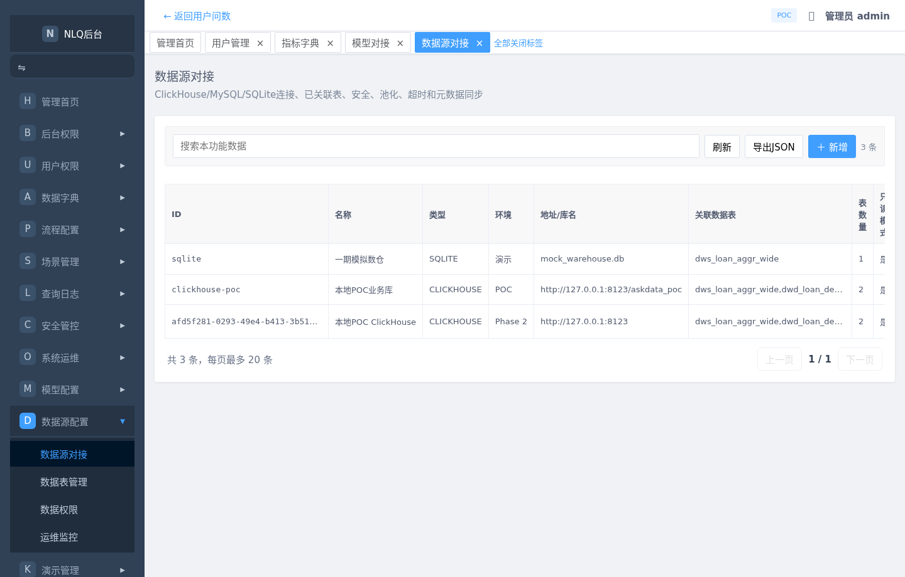

- 模型参数与数据源连接分离配置。
- API Key、密码等秘密不回显、不写日志。
- 数据源只读、白名单、超时、重试和并发限制。
- 模型、数据源和运行组合独立诊断与启用。
- Demo、POC、产品及客户配置隔离。

**布局与展示**：三列卡片“模型配置—运行组合—数据源配置”，秘密引用用锁形图标。

## 第23页｜运行监控、告警与审计

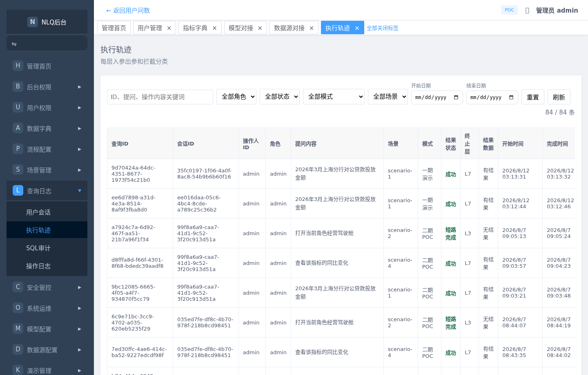

- 会话、请求、七层轨迹和终止状态。
- SQL耗时、行数、错误及降级信息。
- 模型与数据源Provider调用记录。
- 队列、并发、SSE、取消和超载状态。
- 成功率、响应时间、告警通知和审计链。

**布局与展示**：上方四个指标卡，下方左侧趋势图、右侧事件列表；明确监控摘要不展示未脱敏业务问题、SQL或秘密。

## 第24页｜方案特点与优势

**页面文案**：业务友好、口径统一、权限可信、SQL安全、结果可靠、过程透明、平台可管、架构可扩展。

**布局与展示**：2×4优势卡；每卡结构为“4字标题 + 1句证据”，避免空泛形容词。

## 第25页｜业务价值与衡量指标

| 价值方向 | 建议指标 |
|---|---|
| 效率 | 平均取数周期、自助完成率、人工工单减少率 |
| 质量 | 黄金问题准确率、口径一致率、对账通过率 |
| 安全 | 越权拦截率、高危SQL拦截率、审计覆盖率 |
| 体验 | 活跃用户、追问率、满意度、结果复用率 |
| 运维 | 成功率、响应时间、恢复时间、告警闭环率 |

**布局与展示**：五个价值仪表盘；未有真实运营数据时只展示指标定义，不填写承诺值。

## 第26页｜实施与验收路径

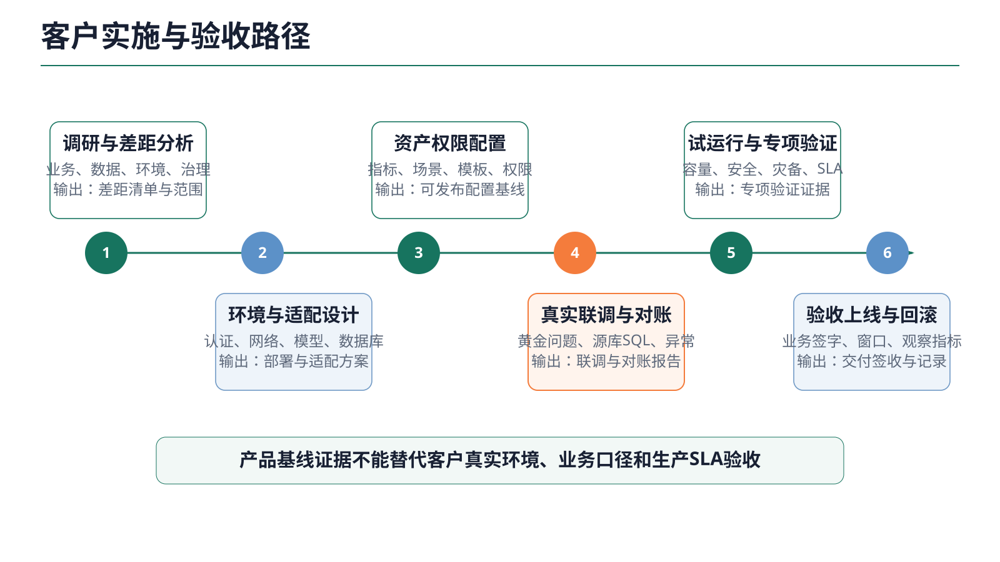

**页面文案**：现状调研与差距分析 → 环境适配 → 数据资产/权限配置 → 真实联调与黄金问题对账 → 试运行与验收上线。

**布局与展示**：五阶段箭头，每阶段标明输入、工作、输出；下方分栏说明“产品基线验收”和“客户项目验收”不能混同。

## 第27页｜V2.0系统架构与能力边界

**页面文案**

- 产品定位：面向企业经营管理的安全可信自然语言问数平台。
- Java控制面负责身份权限、配置审批、发布回滚、运行主记录和审计治理。
- Python执行面负责固定L1—L7问数链路；模型只参与L2理解和L7解读。
- 主要数据能力是已发布指标与字段映射、受控SQL模板及结构化数据源查询。
- V2.0以用户主动提问、一问一查或少量多SQL、事实回答为主要形态。
- 边界：不把通用智能体、任意跨域编排、知识图谱、主动预测和业务写操作表述为V2.0已有能力。

**布局与展示**：左侧或上部展示V2.0技术架构，右侧用“已有能力/明确边界”双栏说明；状态标记为“V2.0产品基线”。

## 第28页｜从V2.0到V3.0：产品定位变化

| 对比维度 | V2.0产品基线 | V3.0规划能力 |
|---|---|---|
| 产品定位 | 安全可信的企业自然语言问数平台 | 领域能力驱动的智能经营分析与决策协同平台 |
| 触发方式 | 用户主动提问 | 提问、订阅、预警、智能报告和分析智能体 |
| 任务形态 | 一问一查或少量多SQL | 一问多查、多步骤、多数据源计划DAG |
| 业务组织 | 场景、指标、模板和流程配置 | 可版本化、可审批的领域能力包 |
| 数据范围 | 结构化数据库为主 | 数据库、业务API、文档、知识图谱和实时数据 |
| 输出结果 | 事实摘要、表格、图表和追问 | 综合结论、异常归因、预测、证据和行动建议 |
| 治理重点 | 权限、SQL安全、事实一致性和全程审计 | 跨域授权、任务完整性、证据链、成本配额和人工确认 |

**布局与展示**：左右对比，V2.0使用湖绿“产品基线”，V3.0使用橙色“规划能力”；底部结论：“V3.0复用V2.0可信底座，不削弱权限、安全、事实和审计边界。”

## 第29页｜V2.0与V3.0七层差异

| 层级 | V2.0产品基线 | V3.0规划能力 |
|---|---|---|
| L1 | 请求封装、输入预检、会话及版本绑定 | 接入对话、订阅、预警、报告和智能体任务 |
| L2 | 要素提取、上下文、缺参歧义、权限合规初检 | 识别领域、能力、跨域需求和候选能力 |
| L3 | 口径归一、意图路由和语义查询计划 | 综合问题拆解、任务依赖、分析路径和完整性要求 |
| L4 | 匹配数据源、表、字段和指标映射 | 匹配授权指标、API、文档、知识和实时数据 |
| L5 | 受控SQL模板及单/多SQL执行计划 | 生成SQL/API/计算/检索组成的版本化计划DAG |
| L6 | SQL安全校验、数据范围注入和受控执行 | 串并行、限流、重试、取消、质量及部分成功判断 |
| L7 | 基于L6事实生成摘要、表格、图表和归因 | 生成证据化结论、异常、预测、未核实项和建议 |

**布局与展示**：三列表格，逐层横向比较；不得把右栏写成已完成。页脚标注“V3.0为候选规划，需经立项和客户场景验证”。

## 第30页｜V3.0七层规划架构与说明

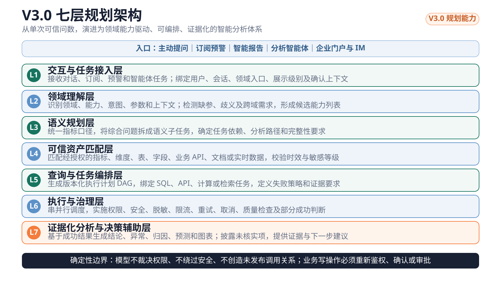

**页面文案**：L1交互与任务接入 → L2领域理解 → L3语义规划 → L4可信资产匹配 → L5查询与任务编排 → L6执行与治理 → L7证据化分析与决策辅助。

**边界说明**：模型可以识别领域、抽取参数、推荐任务和组织回答，但不能裁决权限、绕过安全、创造未发布的跨域调用关系或直接执行高风险业务写操作。L7只能使用成功执行事实；关键任务失败必须披露未核实项，不能回答“整体正常”。

**布局与展示**：架构图占页面85%；右上角固定“V3.0规划能力”标签。

## 第31页｜V3.0愿景与能力地图

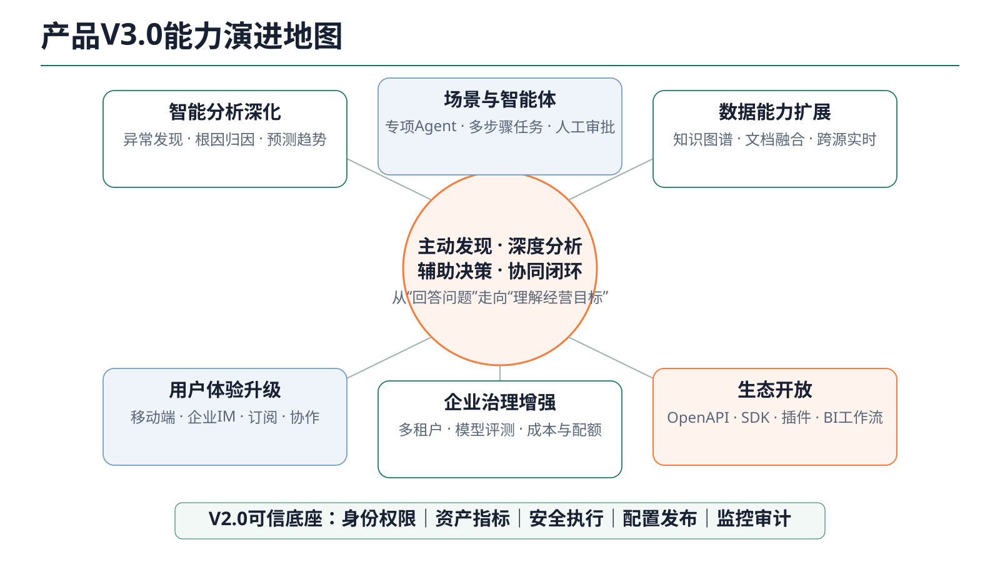

**页面文案**

愿景：从“用户主动问数”升级为“系统理解经营目标、主动发现问题、辅助分析并推动业务闭环”。

六条主线：智能分析深化、场景与智能体、数据能力扩展、用户体验升级、企业治理增强、生态开放。

**布局与展示**：中心愿景，周围六条能力轨道；V2.0底座置于最下方，明确V3.0复用安全、权限、资产、执行和审计能力。

## 第32页｜V3.0场景、路线图与总结

**页面文案**

- 首批候选：经营异常预警、指标波动归因、机构经营诊断、智能日报周报月报、驾驶舱解读、营销机会识别。
- 路线：V2.0基线完成 → 客户适配验证 → V3.0需求与价值排序 → 高价值场景试点 → 智能体与生态平台化。
- 原则：事实与推断分离、业务动作保留人工确认、新能力不影响V2.0稳定交付。

**布局与展示**：上半部场景卡，下半部路线图；结束语居中：“以安全可信问数为基础，逐步构建企业级智能经营分析入口。”
