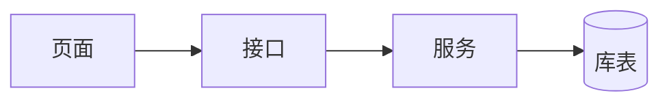

# {端} {日期} {一级菜单/功能} 修改分析模板

## 1. 需求与功能影响

| 功能 | 功能点 | 修改类型 | 验收标准 |
|---|---|---|---|
|  |  | 新增/修改/删除/兼容 |  |

## 2. 修改流程与链路

### 修改前

### 修改后

## 3. 接口清单

| 方法 | 路径 | 请求字段 | 响应字段 | 关联功能 | 修改类型 |
|---|---|---|---|---|---|
|  |  |  |  |  |  |

## 4. 库表与字段清单

| 数据库 | 表 | 字段/JSON路径 | 关联表 | 用途 | DDL/数据影响 |
|---|---|---|---|---|---|
|  |  |  |  |  |  |

## 5. 文件与代码清单

| 文件 | 类/函数/组件 | 关联功能 | 修改内容 | 验证方式 |
|---|---|---|---|---|
|  |  |  |  |  |

## 6. 架构与详细设计

说明职责边界、数据所有权、依赖方向、安全设计、兼容策略和失败处理。

## 7. 执行规划与逐项结果

| 序号 | 任务 | 依赖 | 状态 | 验证证据 |
|---|---|---|---|---|
| 1 |  |  | 待执行/完成/阻塞 |  |

## 8. 四维核对

| 需求编号 | 功能 | 文件 | 接口 | 库表字段 | 测试 |
|---|---|---|---|---|---|
|  |  |  |  |  |  |
