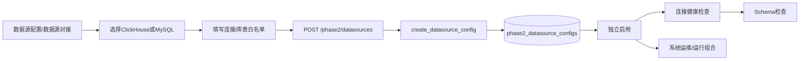
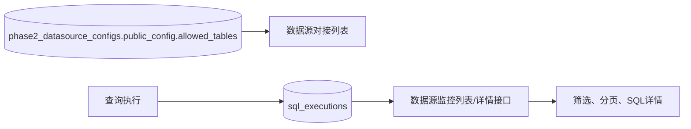

# 管理端 20260807 数据源配置修改流程分析

新增数据源 → 选择ClickHouse/MySQL → 填写连接与安全策略 → 独立加密保存密码 → 独立启用 → 独立连通与Schema诊断。运行组合只引用启用后的数据源ID。

| 文件 | 函数/组件 | 功能 |
|---|---|---|
| `frontend/src/AdminView.vue` | `datasourceConfigPage`、`newDatasource`、`saveRow`、`load` | 数据源独立新增和列表 |
| `frontend/src/admin-api.ts` | `phase2Datasources`、`createPhase2Datasource`、`enablePhase2Datasource`、`diagnosePhase2Datasource` | 数据源接口调用 |
| `backend/app/main.py` | `DatasourceConfigIn`及数据源CRUD/诊断函数 | 校验、加密和诊断 |
| `backend/app/db.py` | `migrate` | 创建独立数据源配置表 |
| `backend/tests/test_phase2.py` | 独立配置测试 | 验证凭据隔离和组合引用 |
## 表信息与监控链路

涉及文件：`backend/app/main.py`、`frontend/src/AdminView.vue`、`backend/tests/test_admin_management.py`。
