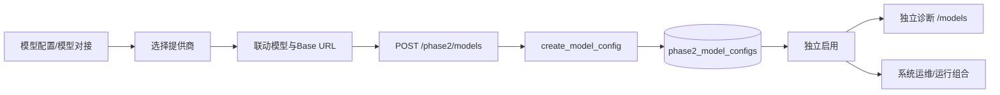

# 管理端 20260807 模型配置修改流程分析

新增流程：选择提供商 → 自动填充默认模型与Base URL → 选择模型 → 输入API Key和生成参数 → 独立保存模型配置 → 独立启用 → 独立诊断。数据源不再出现在模型新增表单中。

自定义兼容服务不提供固定模型列表，模型名称和接口地址保留手工输入能力。二期运行通过“运行组合”引用模型配置，不复制模型密钥。

## 修改后流程链

## 涉及文件与功能

| 文件 | 函数/组件 | 功能 |
|---|---|---|
| `frontend/src/AdminView.vue` | `modelConfigPage`、`newModel`、`saveRow`、`load` | 模型独立新增和列表 |
| `frontend/src/admin-api.ts` | `phase2Models`、`createPhase2Model`、`enablePhase2Model`、`diagnosePhase2Model` | 模型接口调用 |
| `backend/app/main.py` | `ModelConfigIn`、`create_model_config`、`enable_model_config`、`diagnose_model_config` | 校验、加密、启用、诊断 |
| `backend/app/db.py` | `migrate` | 创建独立模型配置表 |
| `backend/tests/test_phase2.py` | `test_model_and_datasource_are_configured_independently` | 独立性和加密回归 |
## 调用日志链路

涉及文件：`backend/app/main.py`、`frontend/src/AdminView.vue`、`backend/tests/test_admin_management.py`。
