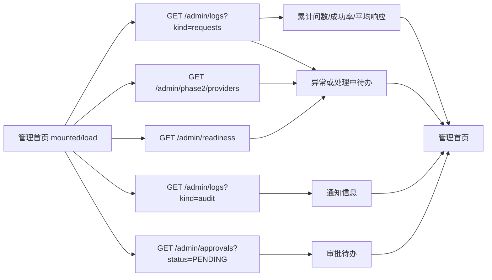

# 管理端 20260807 管理首页修改流程分析

修改集中在 `AdminView.vue` 菜单元数据和 `style.css` 管理端作用域。菜单ID、路由状态、资源kind均保持不变，只更换显示名称；字号通过 `.admin-shell` 统一下调，表格区域显式固定为13px。

## 首页数据链路

## 涉及文件与功能

| 文件 | 函数/组件 | 修改内容 |
|---|---|---|
| `frontend/src/AdminView.vue` | `homeMetrics` | 汇总3项关键指标 |
| `frontend/src/AdminView.vue` | `homeTodos` | 生成待办列表 |
| `frontend/src/AdminView.vue` | `homeNotices` | 转换审计通知 |
| `frontend/src/AdminView.vue` | `homeTrend`、`homeApprovals` | 走势图与审批待办 |
| `frontend/src/AdminView.vue` | `load`首页分支 | 并行加载查询、审计和Profile |
| `frontend/src/style.css` | `.admin-dashboard`等 | 指标卡、双栏列表和响应式样式 |
| `frontend/src/admin-api.ts` | `logs`、`phase2Profiles`、`readiness` | 复用既有接口 |
| `backend/app/main.py` | `approvals` | 查询审批待办 |
| `backend/app/db.py` | `approval_tasks`迁移和种子 | 审批记录持久化 |
