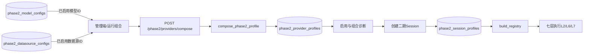

# 管理端 20260807 系统运维修改流程分析

分别启用模型和数据源 → 进入运行组合 → 选择两个配置ID → 创建组合 → 启用并诊断组合 → 用户端二期会话选择组合。

| 文件 | 函数 | 修改功能 |
|---|---|---|
| `frontend/src/AdminView.vue` | `compositionPage`、`add`、`saveRow`、`load` | 运行组合页面和候选联动 |
| `frontend/src/admin-api.ts` | `composePhase2Profile` | 组合接口调用 |
| `backend/app/main.py` | `ProviderCompositionIn`、`compose_phase2_profile` | 校验引用、合并公开参数和加密凭据 |
| `backend/app/phase2_service.py` | `build_registry` | 读取兼容Profile构建运行Provider |
| `backend/app/db.py` | 既有Profile和Session表 | 保存组合和会话引用 |
