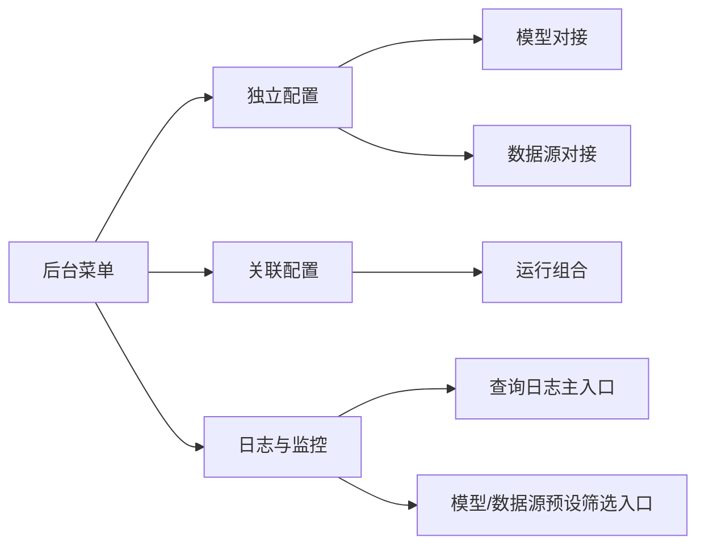

# 管理端 20260807 菜单冗余检查

本轮仅检查，不删除或合并功能。

| 菜单关系 | 检查结论 | 建议 | 本轮动作 |
|---|---|---|---|
| 一级“后台权限”与子菜单“后台权限” | 名称重复，功能不重复 | 子菜单后续改为“权限配置” | 保留 |
| 数据字典“数仓管理”与数据源配置“数据表管理” | 容易混淆；前者是语义资产，后者是物理表接入 | 帮助文案明确逻辑资产/物理表边界 | 保留 |
| 标准场景、参数关联、场景配置 | 数据职责不同；标准定义、参数绑定、Mock覆盖 | 后续可将“场景配置”改为“场景模拟” | 保留 |
| 查询日志、模型调用日志、数据源监控 | 后两者是查询/SQL日志的过滤视图，存在入口重复 | 可改成带预设筛选的快捷入口，不重复存储 | 保留 |
| 就绪检查、模型诊断、数据源诊断、运维监控 | 聚合检查、单连接检查和历史监控职责不同 | 保持分层并统一状态词 | 保留 |
| 模型对接、数据源对接、运行组合 | 拆分后职责清晰 | 模型/数据源独立，组合只引用ID | 保留 |
| 后台角色与用户角色 | 面向管理员和业务用户，权限域不同 | 保持隔离 | 保留 |

优先可优化项为两个：后台权限子菜单重名；查询日志与模型/数据源日志入口重复。删除前需要确认用户是否希望保留快捷入口。
